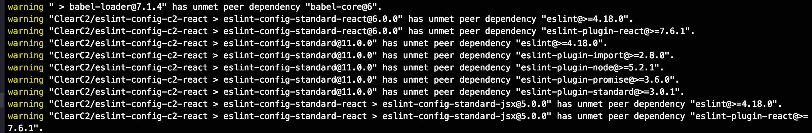

# eslint-config-c2-react

An ESLint Shareable Config for React/JSX support in JavaScript Standard Style

## Pre Install

If your project already has an eslint ruleset that you're converting, remove all eslint dependencies from your `package.json` file.

```sh
yarn remove babel-eslint eslint \
eslint-plugin-import eslint-plugin-node \
eslint-plugin-promise eslint-plugin-react \
eslint-plugin-standard
```

You may have references to other `eslint-config-*` and `eslint-plugin-*` packages. Remove those as well.

## Install
```sh
yarn add -D husky@next lint-staged eslint-config-c2-react
```

Yarn will tell you what dependencies you are missing from the packages `eslint-config-c2-react` references as peer dependencies.



Install these peer dependencies. At the time of creating this readme, that would look like this:

```
yarn add -D eslint eslint-plugin-import eslint-plugin-node eslint-plugin-promise eslint-plugin-react eslint-plugin-standard
```

Create an `.eslintrc.json` file in the root of your project with the following contents:

```json
{
    "extends": [
      "c2-react"
    ]
}
```

Create an `.eslintignore` file with files and folders that should **not** be linted. Example:
```
docs/
src/index.ejs
lib/
dist/
```

## pre-commit

Using a combination of [husky](https://github.com/typicode/husky) and [lint-staged](https://github.com/okonet/lint-staged), configure the
pre-commit hook by adding the following to your project/package's `package.json` file.

```
"husky": {
  "hooks": {
    "pre-commit": "lint-staged"
  }
},
"lint-staged": {
  "src/**/*.js": "eslint"
},
```
The above will lint all `.js` file anywhere within and below the `src` directory.

## Tips
You can always lint your files before you attempt to commit. Example:

```sh
./node_modules/.bin/eslint src/module/Component.js
```

You can also have eslint attempt to fix your files according to the ruleset:

```sh
./node_modules/.bin/eslint --fix src/module/Component.js
# or a directory
./node_modules/.bin/eslint --fix src/module
```

This will catch and fix most of the issues. You will most likely still need to go into the file(s)
to correct what eslint couldn't do automatically. It will show warnings of the problems that still exist after
a fix command is run.
